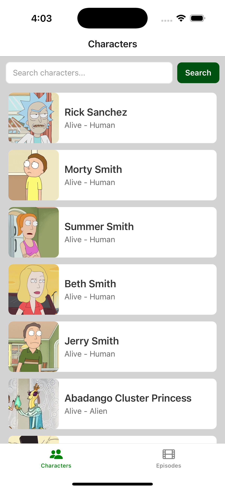
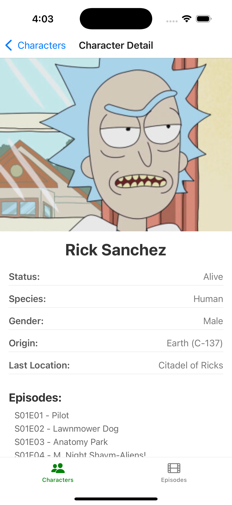
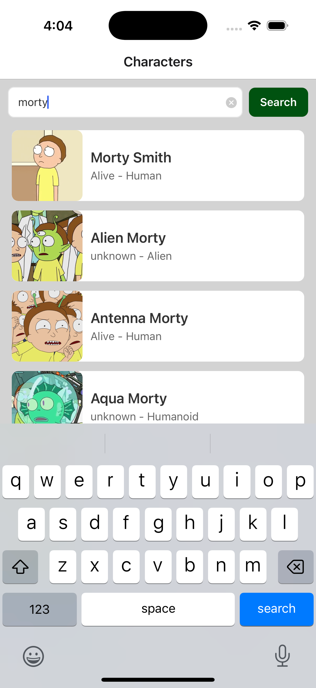
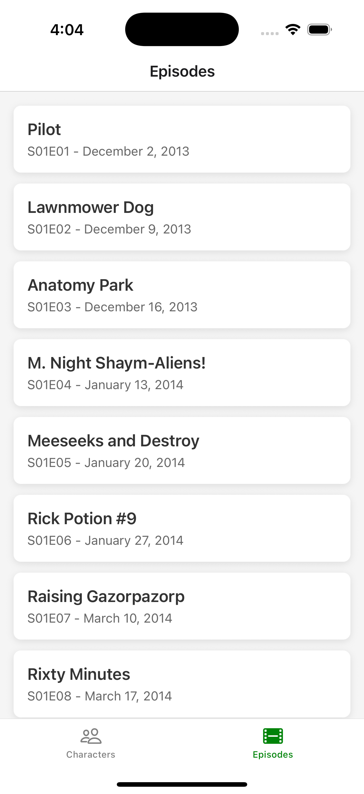

# 📱 Rick and Morty App

A simple React Native app that shows all Rick and Morty characters and their details using GraphQL!
<p float="left"> 




</p>

## 🚀 What it does
- Browse all Rick and Morty characters
- Search for specific characters
- View detailed character information
- See all episodes
- Clean, simple navigation

## 🛠️ Tech Stack
- **React Native** with Expo
- **Apollo Client** for GraphQL
- **TypeScript** for type safety
- **React Navigation** for screens
- **Prettier** for code formatting


---

## 🚀 Getting Started

### Prerequisites
- Node.js version **22.19.0** (use the `.nvmrc` file in the project)
- npm or yarn
- Expo CLI

### Installation

1. **Clone and install dependencies:**
```bash
npm install
```

2. **Start the app:**
```bash
# Start with Expo
npx expo start

```

3. **Run on device/simulator:**
```bash
# For iOS simulator
npx expo start --ios

# For Android emulator  
npx expo start --android

# For web browser
npx expo start --web
```

### Using the .nvmrc file
If you have nvm installed, you can automatically use the correct Node version:
```bash
nvm use
```

---

## 📊 How GraphQL Works in This App

### 1. Apollo Client Setup
The app connects to the Rick and Morty GraphQL API:

```ts

import { ApolloClient, InMemoryCache, HttpLink } from '@apollo/client';

const client = new ApolloClient({
  link: new HttpLink({
    uri: 'https://rickandmortyapi.com/graphql',
  }),
  cache: new InMemoryCache(),
});
```

### 2. GraphQL Queries Examples

**Get all characters:**
```ts
const GET_CHARACTERS = gql`
  query GetCharacters($name: String) {
    characters(filter: { name: $name }) {
      results {
        id
        name
        status
        species
        image
      }
    }
  }
`;
```

**Get character details:**
```ts
const GET_CHARACTER_DETAIL = gql`
  query GetCharacter($id: ID!) {
    character(id: $id) {
      id
      name
      status
      species
      type
      gender
      origin { name }
      location { name }
      image
      episode {
        id
        name
        episode
      }
    }
  }
`;
```

**Get all episodes:**
```ts
const GET_EPISODES = gql`
  query GetEpisodes {
    episodes {
      results {
        id
        name
        episode
        air_date
      }
    }
  }
`;
```

### 3. Using Queries in Components
```ts

const { loading, error, data } = useQuery(GET_CHARACTERS, {
  variables: { name: searchName }
});

if (loading) return <ActivityIndicator />;
if (error) return <Text>Error: {error.message}</Text>;

const characters = data?.characters?.results || [];
```

---

## 📁 Project Structure
```
src/
├── graphql/
│   └── apollo.ts          # Apollo Client setup
├── screens/
│   ├── CharacterListScreen.tsx    # Shows all characters
│   ├── CharaterDetailScreen.tsx   # Character details
│   └── EpisodeListScreen.tsx      # Shows all episodes
└── App.tsx                # Main app with navigation
```

## 🎯 Key Features Explained

### Character List Screen
- Shows all Rick and Morty characters
- Search functionality to filter characters
- Tap any character to see details

### Character Detail Screen  
- Shows full character information
- Displays episodes the character appeared in
- Clean, easy-to-read layout

### Episode List Screen
- Lists all Rick and Morty episodes
- Shows episode numbers and air dates

## Possible Improvements

- **Search filter functionality**: Add a fallback if no results are found and display a friendly message to the user.
- **TypeScript structure**: Move types and interfaces into separate files for better organisation.
- **GraphQL queries**: Place all GraphQL queries in their own folder (e.g., `/queries`) to keep the codebase clean and modular.
- **React Native Expo**: Add a splash screen for better user experience during app loading.
- **Cross-platform testing**: Ensure the app is tested on both iOS and Android for consistent behavior.
- **EAS Build & TestFlight**: Use [EAS Build] to generate builds and submit to TestFlight for real user testing (not required for this code test, but useful in production).
- **Simple local GraphQL + PostgreSQL DB**: To add a tiny local backend: a small PostgreSQL DB plus a basic Node/Apollo GraphQL server exposing the same fields, seeded once from the public API and used in dev. This keeps the UI the same while I practice GraphQL resolvers and simple DB reads/writes.


